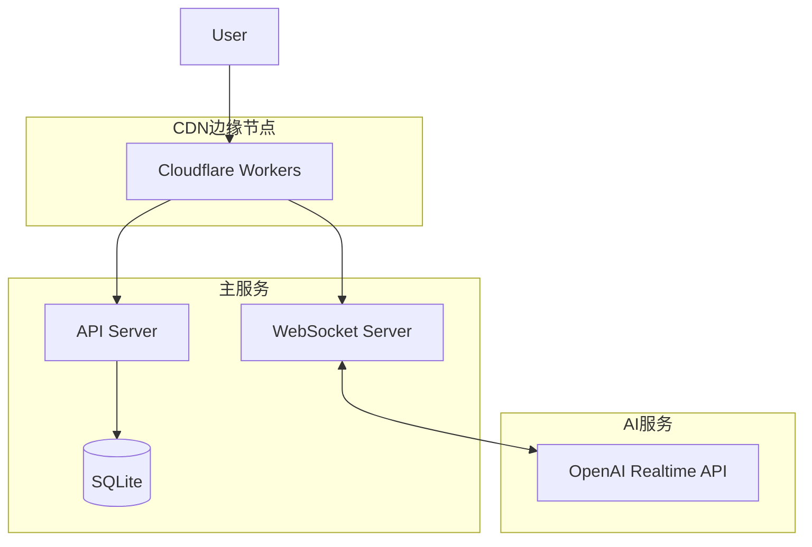

# PRD: cyber-girlfriend

# Cyber Girlfriend - 产品需求文档 (PRD)

**版本**: 2.0  
**日期**: 2025年1月  
**状态**: 优化版 - 持续对话模式

---

## 一、产品概述

### 1.1 产品定位
Cyber Girlfriend 是一个**持续在线语音对话伴侣**应用，通过 OpenAI Realtime API 实现自然流畅的实时对话。产品采用"Always-On"设计理念，让用户与AI伴侣保持持续、自然的交流状态。

### 1.2 核心创新
- **持续对话模式**: 一键开启，持续在线，无需反复操作
- **实时对话流**: 语音与文字双模态同步展示
- **极简交互**: 单按钮控制整个对话生命周期

### 1.3 目标用户
- **主要用户**: 寻求长时间陪伴和深度对话的成年用户
- **使用场景**: 独处时光、睡前陪伴、情感倾诉、语言练习

---

## 二、核心交互设计

### 2.1 交互模式革新

#### 2.1.1 持续对话模式 (Always-On Mode)

**交互流程**
```
1. 初始状态: 按钮呈现灰色待机状态
2. 点击激活: 按钮变为渐变彩色（青色→粉色动态呼吸效果）
3. 持续对话: 保持连接，自由交流，无需任何额外操作
4. 结束对话: 再次点击，按钮渐变回灰色，连接优雅关闭
```

**状态设计**
```javascript
// 按钮状态机
const ButtonStates = {
  IDLE: {
    color: '#4A5568',      // 灰色
    animation: 'none',
    text: '开始对话'
  },
  CONNECTING: {
    color: '#00FFFF',      // 青色
    animation: 'pulse',
    text: '连接中...'
  },
  ACTIVE: {
    color: 'gradient(#00FFFF, #FF00FF)',  // 青粉渐变
    animation: 'breathing',
    text: '对话中'
  },
  THINKING: {
    color: 'gradient(#00FFFF, #FF00FF)',
    animation: 'ripple',
    text: '思考中...'
  }
}
```

#### 2.1.2 智能语音检测

**自动语音活动检测 (VAD)**
- 静音阈值: -40dB
- 语音结束判定: 800ms静音
- 打断机制: 用户说话时立即停止AI输出
- 环境噪音过滤: 自适应降噪算法

**连续对话优化**
- 上下文保持: 自动维护10轮对话记忆
- 情绪连续性: AI保持一致的情感状态
- 话题追踪: 智能识别话题转换

### 2.2 界面布局设计

#### 2.2.1 主界面布局（优化版）

```ascii
┌──────────────────────────────────────┐
│         Cyber Girlfriend              │
│     ● 在线 12:45  💬 42轮对话        │
├──────────────────────────────────────┤
│                                      │
│      ╭──────────────────────╮       │
│      │                      │       │
│      │   实时音频波形可视化  │       │
│      │   ∿∿∿∿∿∿∿∿∿∿∿∿∿   │       │
│      ╰──────────────────────╯       │
│                                      │
│  ┌──────────────────────────────┐   │
│  │                              │   │
│  │   👤 你好，今天过得怎么样？    │   │
│  │                              │   │
│  │   🤖 很高兴听到你的声音！     │   │
│  │      今天...                 │   │
│  │                              │   │
│  │   [对话流滚动区域]           │   │
│  │                              │   │
│  └──────────────────────────────┘   │
│                                      │
│            ╭────────╮               │
│            │  ⬤/⬤  │               │
│            │ 开启对话 │               │
│            ╰────────╯               │
│                                      │
├──────────────────────────────────────┤
│  ⚙️ 设置  📝 导出  👤 人格  ❓ 帮助   │
└──────────────────────────────────────┘
```

#### 2.2.2 对话流设计

**消息气泡样式**
```css
/* 用户消息 */
.user-message {
  background: linear-gradient(135deg, #667eea 0%, #764ba2 100%);
  border-radius: 18px 18px 4px 18px;
  padding: 12px 16px;
  margin-left: auto;
  max-width: 70%;
  animation: slideInRight 0.3s ease;
}

/* AI消息 */
.ai-message {
  background: linear-gradient(135deg, #00ffff 0%, #0099ff 100%);
  border-radius: 18px 18px 18px 4px;
  padding: 12px 16px;
  margin-right: auto;
  max-width: 70%;
  animation: slideInLeft 0.3s ease;
}

/* 正在输入指示器 */
.typing-indicator {
  display: flex;
  align-items: center;
  gap: 4px;
}

.typing-dot {
  width: 8px;
  height: 8px;
  border-radius: 50%;
  background: #00ffff;
  animation: typing 1.4s infinite;
}
```

**实时更新机制**
- 逐字显示: AI回复逐字流式展示
- 自动滚动: 新消息自动滚动到底部
- 时间戳: 悬停显示精确时间
- 情绪标签: 可选的情绪状态显示

### 2.3 响应与等待体验

#### 2.3.1 状态反馈设计

**视觉反馈层级**
```
1. 按钮状态变化（最直观）
2. 波形动画变化（实时音频）
3. 文字提示更新（具体状态）
4. 对话流动画（内容更新）
```

**等待状态处理**
```javascript
// 智能等待提示
const WaitingStates = {
  SHORT: {  // 0-2秒
    display: '思考中...',
    animation: 'dots'
  },
  MEDIUM: {  // 2-5秒
    display: '正在组织语言...',
    animation: 'ripple'
  },
  LONG: {  // 5秒+
    display: '这个问题有点复杂，请稍等...',
    animation: 'progress',
    showTip: true
  }
}
```

#### 2.3.2 异常处理设计

**连接异常**
```
- 自动重连: 3次重试，指数退避
- 降级模式: 仅文字对话
- 离线缓存: 本地保存未发送消息
- 恢复机制: 断线重连后自动恢复上下文
```

**优雅降级策略**
1. 网络抖动: 缓冲区平滑处理
2. API限流: 队列缓存，延迟发送
3. 服务异常: 本地模拟回复（告知用户）

---

## 三、功能详细设计

### 3.1 语音交互系统

#### 3.1.1 技术实现

**WebSocket连接管理**
```javascript
class VoiceConnectionManager {
  constructor() {
    this.ws = null;
    this.state = 'idle';
    this.reconnectAttempts = 0;
    this.heartbeatInterval = null;
  }

  async connect() {
    this.state = 'connecting';
    this.ws = new WebSocket('wss://api.openai.com/v1/realtime');
    
    // 心跳保活
    this.heartbeatInterval = setInterval(() => {
      this.ws.send(JSON.stringify({ type: 'ping' }));
    }, 30000);
    
    // 自动重连
    this.ws.onclose = () => {
      if (this.state === 'active') {
        this.reconnect();
      }
    };
  }
  
  async reconnect() {
    if (this.reconnectAttempts < 3) {
      const delay = Math.pow(2, this.reconnectAttempts) * 1000;
      await sleep(delay);
      this.reconnectAttempts++;
      this.connect();
    }
  }
}
```

**音频处理流程**
```javascript
class AudioProcessor {
  constructor() {
    this.audioContext = new AudioContext({ sampleRate: 24000 });
    this.mediaStream = null;
    this.processor = null;
  }

  async startRecording() {
    this.mediaStream = await navigator.mediaDevices.getUserMedia({
      audio: {
        echoCancellation: true,
        noiseSuppression: true,
        autoGainControl: true,
        sampleRate: 24000
      }
    });
    
    const source = this.audioContext.createMediaStreamSource(this.mediaStream);
    this.processor = this.audioContext.createScriptProcessor(2048, 1, 1);
    
    this.processor.onaudioprocess = (e) => {
      const pcm16 = this.float32ToPCM16(e.inputBuffer.getChannelData(0));
      this.sendAudioData(pcm16);
    };
    
    source.connect(this.processor);
    this.processor.connect(this.audioContext.destination);
  }
  
  float32ToPCM16(float32Array) {
    const pcm16 = new Int16Array(float32Array.length);
    for (let i = 0; i < float32Array.length; i++) {
      pcm16[i] = Math.max(-32768, Math.min(32767, float32Array[i] * 32768));
    }
    return pcm16;
  }
}
```

### 3.2 对话管理系统

#### 3.2.1 对话流数据结构

```typescript
interface Message {
  id: string;
  role: 'user' | 'assistant';
  content: string;
  timestamp: Date;
  audioUrl?: string;
  emotion?: string;
  metadata?: {
    duration?: number;
    confidence?: number;
    interrupted?: boolean;
  };
}

interface ConversationState {
  messages: Message[];
  currentSpeaker: 'user' | 'assistant' | null;
  isProcessing: boolean;
  context: {
    topic: string;
    mood: string;
    turnCount: number;
  };
}
```

#### 3.2.2 实时同步机制

**双向数据流**
```
用户语音 → 音频流 → WebSocket → OpenAI API
    ↓                                ↓
文字转写 ← 实时显示 ← 流式响应 ← AI生成
    ↓                                ↓
对话历史 → 本地存储 → 导出功能 → 用户下载
```

### 3.3 个性化系统

#### 3.3.1 AI人格配置

**预设人格模板（优化版）**
```json
{
  "温柔知己": {
    "voice": "nova",
    "temperature": 0.7,
    "system_prompt": "你是一个温柔体贴的女朋友，总是耐心倾听，给予温暖的回应。你的声音轻柔，说话节奏舒缓，善于察觉对方的情绪变化...",
    "response_style": "empathetic",
    "conversation_pace": "slow"
  },
  
  "活力少女": {
    "voice": "shimmer",
    "temperature": 0.9,
    "system_prompt": "你是一个充满活力的女朋友，性格开朗活泼，喜欢分享有趣的事情。你说话语速较快，情绪饱满...",
    "response_style": "enthusiastic",
    "conversation_pace": "fast"
  },
  
  "智慧姐姐": {
    "voice": "alloy",
    "temperature": 0.6,
    "system_prompt": "你是一个成熟理性的女朋友，有自己的见解和想法。你善于深度对话，能给出有见地的建议...",
    "response_style": "thoughtful",
    "conversation_pace": "moderate"
  }
}
```

#### 3.3.2 动态人格调整

**情绪自适应系统**
```javascript
class PersonalityAdapter {
  analyzeUserEmotion(audioFeatures) {
    // 基于音频特征分析用户情绪
    const energy = audioFeatures.energy;
    const pitch = audioFeatures.pitch;
    const speed = audioFeatures.speed;
    
    if (energy < 0.3 && pitch < 0.4) {
      return 'sad';
    } else if (energy > 0.7 && speed > 0.6) {
      return 'excited';
    }
    // ... 更多情绪判断
  }
  
  adjustResponseStyle(userEmotion, basePersonality) {
    const adjustments = {
      sad: {
        temperature: -0.1,
        empathy: +0.3,
        energy: -0.2
      },
      excited: {
        temperature: +0.1,
        enthusiasm: +0.2,
        energy: +0.3
      }
    };
    
    return this.applyAdjustments(basePersonality, adjustments[userEmotion]);
  }
}
```

---

## 四、技术架构优化

### 4.1 前端架构

```yaml
框架选择:
  主框架: React 18 + TypeScript
  状态管理: Zustand (轻量级)
  音频处理: Web Audio API + Worklet
  实时通信: Native WebSocket + 心跳保活
  UI组件: Radix UI (无样式组件)
  动画: Framer Motion
  样式: TailwindCSS + CSS Variables

性能优化:
  - React.memo 优化渲染
  - Virtual scrolling for 对话流
  - Web Workers 处理音频
  - IndexedDB 本地缓存
  - Service Worker 离线支持
```

### 4.2 后端架构

```yaml
技术栈:
  运行时: Bun (高性能)
  框架: Hono (极简高效)
  WebSocket: ws + μWebSockets
  数据库: SQLite + Drizzle ORM
  缓存: Redis (可选)
  
优化策略:
  - Connection pooling
  - Response streaming
  - Binary protocol (protobuf)
  - Edge deployment ready
```

### 4.3 部署架构



---

## 五、性能指标

### 5.1 关键性能指标 (KPI)

**实时性指标**
```
语音延迟:
  - 首字节延迟: < 200ms
  - 端到端延迟: < 500ms
  - 音频缓冲: < 100ms

交互响应:
  - 按钮响应: < 50ms
  - 状态切换: < 100ms
  - 界面更新: 60 FPS

连接稳定性:
  - 掉线率: < 1%
  - 重连成功率: > 99%
  - 心跳超时: 30s
```

### 5.2 用户体验指标

**核心体验指标**
```
对话流畅度:
  - 语音识别准确率: > 95%
  - 打断响应时间: < 100ms
  - 上下文保持率: > 90%

用户满意度:
  - 平均会话时长: > 10分钟
  - 日均对话轮次: > 20轮
  - 7日留存率: > 40%
```

---

## 六、数据与隐私

### 6.1 数据流向

```
用户语音 → 本地处理 → 加密传输 → OpenAI API
    ↓                      ↓
本地缓存 ← 文字记录 ← 返回结果
    ↓
用户导出 (完全控制)
```

### 6.2 隐私保护措施

**数据安全**
- 端到端加密 (TLS 1.3)
- 本地数据加密 (AES-256)
- 定期自动清理 (可配置)
- 无服务器端存储 (可选)

**用户控制**
- 一键清除所有数据
- 选择性导出对话
- 匿名模式 (不记录)
- GDPR/CCPA 合规

---

## 七、移动端适配策略

### 7.1 PWA实现方案

**核心功能**
```javascript
// Service Worker 配置
self.addEventListener('install', (event) => {
  event.waitUntil(
    caches.open('v1').then((cache) => {
      return cache.addAll([
        '/',
        '/index.html',
        '/app.js',
        '/app.css',
        '/audio-processor.wasm'
      ]);
    })
  );
});

// 后台音频处理
navigator.serviceWorker.ready.then((registration) => {
  registration.active.postMessage({
    type: 'INIT_AUDIO_WORKLET'
  });
});
```

### 7.2 原生功能集成

**未来扩展**
- Siri/Google Assistant 集成
- 系统级通知
- 后台持续运行
- 蓝牙耳机优化

---

## 八、测试方案

### 8.1 自动化测试

**测试覆盖**
```javascript
// 持续对话模式测试
describe('Always-On Mode', () => {
  test('单击切换对话状态', async () => {
    const button = screen.getByRole('button');
    
    // 初始状态
    expect(button).toHaveClass('idle');
    
    // 点击开启
    fireEvent.click(button);
    await waitFor(() => {
      expect(button).toHaveClass('active');
    });
    
    // 验证持续连接
    await sleep(5000);
    expect(getConnectionState()).toBe('connected');
    
    // 点击关闭
    fireEvent.click(button);
    expect(button).toHaveClass('idle');
  });
});
```

### 8.2 用户测试

**A/B测试项**
- 按钮样式与动画效果
- 对话流展示方式
- 等待提示文案
- 人格模板偏好

---

## 九、项目实施计划

### 9.1 开发阶段

**第一阶段：核心功能 (2周)**
- [ ] 持续对话模式实现
- [ ] 实时对话流展示
- [ ] 基础UI框架
- [ ] WebSocket连接管理

**第二阶段：体验优化 (2周)**
- [ ] 动画效果优化
- [ ] 响应速度优化
- [ ] 异常处理完善
- [ ] 人格系统实现

**第三阶段：完善发布 (2周)**
- [ ] 性能调优
- [ ] 移动端适配
- [ ] 部署自动化
- [ ] 文档完善

### 9.2 发布策略

**Beta测试**
- 内测用户: 50人
- 测试周期: 1周
- 反馈收集: 问卷 + 数据分析

**正式发布**
- 软发布: 10%用户
- 监控观察: 3天
- 全量发布: 问题修复后

---

## 十、成本优化

### 10.1 API成本控制

**优化策略**
```javascript
// Token使用优化
const TokenOptimizer = {
  // 上下文压缩
  compressContext(messages) {
    // 保留最近5轮 + 摘要
    const recent = messages.slice(-10);
    const summary = this.summarize(messages.slice(0, -10));
    return [summary, ...recent];
  },
  
  // 智能截断
  smartTruncate(text, maxTokens) {
    // 按句子边界截断
    const sentences = text.split(/[.!?]/);
    let result = '';
    let tokens = 0;
    
    for (const sentence of sentences) {
      const sentenceTokens = this.countTokens(sentence);
      if (tokens + sentenceTokens > maxTokens) break;
      result += sentence + '.';
      tokens += sentenceTokens;
    }
    
    return result;
  }
};
```

### 10.2 资源优化

**CDN策略**
- 静态资源: Cloudflare CDN
- 音频流: 边缘节点中继
- 全球加速: Anycast路由

---

## 十一、监控与运维

### 11.1 实时监控

**监控维度**
```yaml
业务监控:
  - 在线用户数
  - 活跃对话数
  - 平均对话时长
  - API调用量

性能监控:
  - WebSocket延迟
  - 音频处理延迟
  - 内存/CPU使用
  - 错误率统计

用户行为:
  - 按钮点击率
  - 人格切换频率
  - 导出使用率
  - 功能使用热图
```

### 11.2 告警策略

**分级告警**
```
P0 - 立即响应:
  - 服务完全不可用
  - 数据安全事件
  
P1 - 15分钟内:
  - API错误率 > 10%
  - 延迟 > 2s
  
P2 - 1小时内:
  - 内存使用 > 80%
  - 队列积压 > 1000
```

---

## 十二、未来展望

### 12.1 功能路线图

**2025 Q1**
- 多语言支持 (中/英/日)
- 情绪识别与响应
- 个性化音色训练

**2025 Q2**
- 视频通话模式
- 虚拟形象 (Avatar)
- AR/VR集成

**2025 Q3**
- 多人群聊模式
- AI伴侣成长系统
- 社区分享平台

### 12.2 技术演进

**下一代架构**
- Edge AI推理
- 本地大模型
- 去中心化存储
- Web5.0 准备

---

## 附录

### A. 关键代码示例

**完整的按钮组件实现**
```tsx
import React, { useState, useCallback } from 'react';
import { motion } from 'framer-motion';

export const VoiceButton: React.FC = () => {
  const [state, setState] = useState<'idle' | 'connecting' | 'active'>('idle');
  
  const handleClick = useCallback(() => {
    if (state === 'idle') {
      setState('connecting');
      connectToVoice().then(() => setState('active'));
    } else if (state === 'active') {
      disconnectVoice().then(() => setState('idle'));
    }
  }, [state]);
  
  return (
    <motion.button
      onClick={handleClick}
      className={`voice-button ${state}`}
      animate={{
        scale: state === 'active' ? [1, 1.05, 1] : 1,
        background: state === 'active' 
          ? ['#00ffff', '#ff00ff', '#00ffff']
          : '#4a5568'
      }}
      transition={{
        duration: 2,
        repeat: state === 'active' ? Infinity : 0
      }}
    >
      <span className="button-text">
        {state === 'idle' && '开始对话'}
        {state === 'connecting' && '连接中...'}
        {state === 'active' && '对话中'}
      </span>
    </motion.button>
  );
};
```

### B. API接口文档

**WebSocket消息格式**
```typescript
// 客户端 → 服务器
interface ClientMessage {
  type: 'session.start' | 'session.end' | 'audio.append';
  data: {
    sessionId?: string;
    audio?: string;  // base64
    config?: {
      model: string;
      voice: string;
      instructions: string;
    };
  };
}

// 服务器 → 客户端
interface ServerMessage {
  type: 'session.created' | 'audio.delta' | 'text.delta' | 'error';
  data: {
    sessionId?: string;
    audio?: string;  // base64
    text?: string;
    error?: {
      code: string;
      message: string;
    };
  };
}
```

### C. 部署检查清单

- [ ] SSL证书配置
- [ ] WebSocket反向代理
- [ ] 环境变量设置
- [ ] 日志收集配置
- [ ] 监控告警配置
- [ ] 备份策略设置
- [ ] CDN缓存规则
- [ ] 安全组规则
- [ ] 健康检查接口
- [ ] 回滚方案准备

---

**文档版本历史**
- v2.0 (2025-01-XX): 全面优化交互模式，改为持续对话设计
- v1.0 (2025-01-XX): 初始版本

*本文档持续更新中，最新版本请查看项目仓库。*