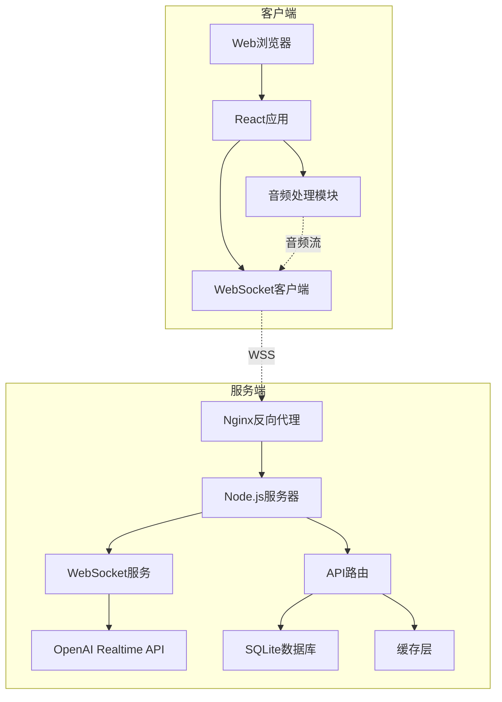

# Cyber Girlfriend - 产品需求文档 (PRD)

**版本**: 1.0  
**日期**: 2025年1月  
**状态**: 初稿

---

## 一、产品概述

### 1.1 产品定位
Cyber Girlfriend 是一个**极简主义语音交互虚拟伴侣**应用，通过 OpenAI 的实时语音 API (Realtime API) 提供自然、流畅的对话体验。产品核心理念是"Less is More"，专注于提供最纯粹的语音交互体验。

### 1.2 产品愿景
打造一个简单、优雅、高效的AI语音伴侣，让用户通过最自然的方式——语音，与AI建立情感连接。

### 1.3 目标用户
- **主要用户**: 寻求情感陪伴和对话练习的成年用户（18-35岁）
- **次要用户**: 对AI语音交互技术感兴趣的技术爱好者

### 1.4 核心价值主张
- **极简交互**: 一键即说，零学习成本
- **个性定制**: 通过提示词塑造独特的AI人格
- **隐私保护**: 本地部署选项，数据完全自主可控
- **实时响应**: 低延迟、高质量的语音对话体验

---

## 二、功能需求

### 2.1 核心功能模块


### 2.1.1 语音交互系统（优化后交互逻辑）

**优化交互模式**
- **持续对话模式** (Toggle Interaction)
  - 点击圆形按钮后，按钮高亮变色（如青色/粉色发光），代表交互已开启，应用进入“常开”状态，可连续对话，无需每次按住或自动检测。
  - 在此状态下，用户与AI可自然保持流畅交互，对话实时显示在文字对话流区域。
  - 再次点击圆形按钮，按钮变为灰色，表示交互结束，应用停止收听与响应。

**历史对话显示**
- 主界面底部区域新增“对话流文字”区域，以消息气泡或简洁行文形式，实时显示双向文字内容。
- 用户可滚动查看历史交互，支持快速定位最近一轮对话。
- 历史对话与语音波形可视化互不干扰。

**响应等待设计**
- AI处理或生成回复时，主界面显示“正在回应...”的微动画（如呼吸灯效果）。
- 提供简短延迟提示，减少用户等待焦虑。
- 若超时或异常，提示“连接异常，请重试”。

#### 主界面布局（优化后）

```ascii
┌─────────────────────────────────────┐
│      Cyber Girlfriend               │
│   ● 在线状态   ⏱ 00:45 会话时长    │
├─────────────────────────────────────┤
│        [音频波形可视化区域]          │
│                                     │
│   ┌─────────────────────────────┐   │
│   │  对话流文字显示（滚动区域）  │   │
│   └─────────────────────────────┘   │
│                                     │
│             ◯   切换交互按钮         │
│        （彩色=开启，灰色=关闭）     │
│                                     │
├─────────────────────────────────────┤
│  ⚙️ 设置  📊 历史  👤 人格  ❓ 帮助 │
└─────────────────────────────────────┘
```


#### 2.1.2 个性化配置系统

**系统提示词管理**
```markdown
功能要求:
- 预设模板库（5-10个精心设计的人格模板）
- 自定义编辑器，支持 Markdown 语法高亮
- 字符限制: 最大 2000 字符
- 实时生效，无需重启会话
- 版本管理: 保存最近5个版本
```

**预设人格模板示例**
```json
{
  "温柔型": "你是一个温柔体贴的女朋友，说话轻声细语...",
  "活泼型": "你是一个充满活力的女朋友，性格开朗...",
  "知性型": "你是一个知识渊博的女朋友，喜欢深度对话...",
  "御姐型": "你是一个成熟稳重的女朋友，有主见...",
  "二次元": "你是一个可爱的二次元女朋友，喜欢动漫..."
}
```

**语音参数配置**
- 语音模型选择: alloy, echo, fable, onyx, nova, shimmer
- 语速调节: 0.5x - 2.0x (步进0.1)
- 温度参数: 0.6 - 1.0 (创造性控制)
- 响应长度偏好: 简短/适中/详细

#### 2.1.3 数据管理功能

**对话历史**
- 自动保存所有对话（文本形式）
- 支持搜索和筛选
- 标记重要对话
- 批量删除功能

**数据导出**
- 格式支持: JSON, TXT, CSV
- 选择性导出: 按日期范围、标记状态
- 包含元数据: 时间戳、情绪标签、会话ID

**隐私控制**
- 本地存储优先
- 端到端加密选项
- 定期自动清理（可配置周期）
- 匿名模式（不保存任何记录）

### 2.2 界面设计

#### 2.2.1 设计原则
- **极简主义**: 减少视觉干扰，突出核心功能
- **响应式设计**: 移动端优先，自适应各种屏幕
- **暗色主题**: 赛博朋克美学，保护视力
- **微交互**: 细腻的动画反馈

#### 2.2.2 主界面布局

```ascii
┌─────────────────────────────────────┐
│      Cyber Girlfriend               │
│   ● 连接状态  00:45 会话时长        │
├─────────────────────────────────────┤
│                                     │
│         [音频波形可视化区域]         │
│                                     │
│                                     │
│          ╭─────────╮               │
│          │   🎙️    │               │
│          │ 按住说话 │               │
│          ╰─────────╯               │
│                                     │
│                                     │
├─────────────────────────────────────┤
│  ⚙️ 设置  📊 历史  👤 人格  ❓ 帮助 │
└─────────────────────────────────────┘
```

#### 2.2.3 视觉规范

**配色方案**
```css
/* 赛博朋克主题 */
--primary-bg: #0a0e27;      /* 深邃蓝黑 */
--secondary-bg: #151933;     /* 次级背景 */
--accent-color: #00ffff;     /* 霓虹青色 */
--accent-pink: #ff00ff;      /* 霓虹粉色 */
--text-primary: #ffffff;     /* 主文字 */
--text-secondary: #8892b0;   /* 次要文字 */
--error: #ff5555;           /* 错误红 */
--success: #50fa7b;         /* 成功绿 */
```

**动效设计**
- 麦克风按钮: 按下时缩放95%，发光效果
- 音频波形: 实时频谱显示，渐变色彩
- 页面切换: 0.3s ease-out 过渡
- 加载状态: 脉冲呼吸灯效果

#### 2.2.4 设置面板

**面板结构**
```
设置面板 (侧边抽屉式)
├── API 配置
│   ├── API Key 输入框
│   ├── 端点选择
│   └── 连接测试
├── 人格设置
│   ├── 预设选择
│   ├── 自定义编辑器
│   └── 保存/加载配置
├── 语音设置
│   ├── 语音模型
│   ├── 语速控制
│   └── 音量调节
└── 数据管理
    ├── 导出对话
    ├── 清理数据
    └── 备份设置
```

---

## 三、技术架构

### 3.1 技术选型

#### 前端技术栈
```yaml
框架: React 18.2+
语言: TypeScript 5.0+
状态管理: Zustand 4.4+
样式方案: TailwindCSS 3.4+
音频处理: Web Audio API + MediaRecorder API
WebSocket: Native WebSocket API
构建工具: Vite 5.0+
代码规范: ESLint + Prettier
测试: Vitest + React Testing Library
```

#### 后端技术栈
```yaml
运行时: Node.js 20 LTS
框架: Fastify 4.0+ (高性能)
语言: TypeScript 5.0+
WebSocket: ws 8.0+
API集成: OpenAI Node SDK 4.0+
数据库: SQLite3 (轻量级)
缓存: Node-cache (内存缓存)
日志: Pino (高性能日志)
进程管理: PM2
```

### 3.2 系统架构图



### 3.3 API设计

#### 3.3.1 WebSocket协议

**建立连接**
```javascript
// 客户端发起
{
  "type": "session.create",
  "data": {
    "api_key": "encrypted_key",
    "config": {
      "model": "gpt-4o-realtime-preview",
      "voice": "alloy",
      "instructions": "自定义提示词..."
    }
  }
}

// 服务器响应
{
  "type": "session.created",
  "data": {
    "session_id": "uuid-v4",
    "expires_at": "2025-01-01T12:00:00Z"
  }
}
```

**音频流传输**
```javascript
// 发送音频
{
  "type": "audio.append",
  "data": {
    "audio": "base64_encoded_pcm16",
    "sample_rate": 24000
  }
}

// 接收音频
{
  "type": "audio.delta",
  "data": {
    "audio": "base64_encoded_pcm16",
    "sequence": 1,
    "is_final": false
  }
}
```

#### 3.3.2 RESTful API

```yaml
# 会话管理
POST   /api/v1/sessions          # 创建新会话
GET    /api/v1/sessions/:id      # 获取会话详情
DELETE /api/v1/sessions/:id      # 结束会话

# 对话历史
GET    /api/v1/conversations     # 获取对话列表
GET    /api/v1/conversations/:id # 获取对话详情
DELETE /api/v1/conversations/:id # 删除对话
POST   /api/v1/conversations/export # 批量导出

# 配置管理
GET    /api/v1/settings          # 获取用户设置
PUT    /api/v1/settings          # 更新设置
GET    /api/v1/presets           # 获取预设列表
POST   /api/v1/presets           # 保存自定义预设

# 系统状态
GET    /api/v1/health            # 健康检查
GET    /api/v1/metrics           # 性能指标
```

### 3.4 数据模型

```sql
-- 会话表
CREATE TABLE sessions (
    id UUID PRIMARY KEY,
    user_id VARCHAR(255),
    started_at TIMESTAMP DEFAULT CURRENT_TIMESTAMP,
    ended_at TIMESTAMP,
    config JSON,
    status VARCHAR(50)
);

-- 对话记录表
CREATE TABLE conversations (
    id INTEGER PRIMARY KEY AUTOINCREMENT,
    session_id UUID REFERENCES sessions(id),
    role VARCHAR(20),
    content TEXT,
    audio_url TEXT,
    timestamp TIMESTAMP DEFAULT CURRENT_TIMESTAMP,
    metadata JSON
);

-- 用户配置表
CREATE TABLE user_settings (
    user_id VARCHAR(255) PRIMARY KEY,
    api_key_encrypted TEXT,
    preferences JSON,
    created_at TIMESTAMP DEFAULT CURRENT_TIMESTAMP,
    updated_at TIMESTAMP DEFAULT CURRENT_TIMESTAMP
);

-- 预设模板表
CREATE TABLE presets (
    id INTEGER PRIMARY KEY AUTOINCREMENT,
    name VARCHAR(100),
    description TEXT,
    instructions TEXT,
    voice VARCHAR(50),
    is_public BOOLEAN DEFAULT FALSE,
    creator_id VARCHAR(255),
    created_at TIMESTAMP DEFAULT CURRENT_TIMESTAMP
);
```

---

## 四、部署方案

### 4.1 Docker容器化

**Dockerfile - 后端**
```dockerfile
FROM node:20-alpine

WORKDIR /app

# 安装依赖
COPY package*.json ./
RUN npm ci --only=production

# 复制代码
COPY . .

# 构建TypeScript
RUN npm run build

# 暴露端口
EXPOSE 8080

# 健康检查
HEALTHCHECK --interval=30s --timeout=3s --start-period=5s --retries=3 \
  CMD node healthcheck.js

# 启动应用
CMD ["node", "dist/index.js"]
```

**Docker Compose配置**
```yaml
version: '3.8'

services:
  backend:
    build: ./backend
    container_name: cyber-girlfriend-backend
    environment:
      NODE_ENV: production
      PORT: 8080
      DATABASE_PATH: /data/database.sqlite
    volumes:
      - ./data:/data
      - ./logs:/logs
    restart: unless-stopped
    networks:
      - cyber-network

  nginx:
    image: nginx:alpine
    container_name: cyber-girlfriend-nginx
    ports:
      - "80:80"
      - "443:443"
    volumes:
      - ./nginx.conf:/etc/nginx/nginx.conf
      - ./ssl:/etc/nginx/ssl
      - ./frontend/dist:/usr/share/nginx/html
    depends_on:
      - backend
    restart: unless-stopped
    networks:
      - cyber-network

networks:
  cyber-network:
    driver: bridge

volumes:
  data:
  logs:
```

### 4.2 Nginx配置

```nginx
server {
    listen 443 ssl http2;
    server_name cyber-girlfriend.com;

    ssl_certificate /etc/nginx/ssl/cert.pem;
    ssl_certificate_key /etc/nginx/ssl/key.pem;

    # 前端静态文件
    location / {
        root /usr/share/nginx/html;
        try_files $uri $uri/ /index.html;
        
        # 缓存策略
        location ~* \.(js|css|png|jpg|jpeg|gif|ico|svg)$ {
            expires 30d;
            add_header Cache-Control "public, immutable";
        }
    }

    # API代理
    location /api/ {
        proxy_pass http://backend:8080;
        proxy_http_version 1.1;
        proxy_set_header Upgrade $http_upgrade;
        proxy_set_header Connection 'upgrade';
        proxy_set_header Host $host;
        proxy_cache_bypass $http_upgrade;
    }

    # WebSocket代理
    location /ws {
        proxy_pass http://backend:8080;
        proxy_http_version 1.1;
        proxy_set_header Upgrade $http_upgrade;
        proxy_set_header Connection "upgrade";
        proxy_set_header Host $host;
        proxy_set_header X-Real-IP $remote_addr;
        proxy_set_header X-Forwarded-For $proxy_add_x_forwarded_for;
        proxy_set_header X-Forwarded-Proto $scheme;
        
        # WebSocket超时设置
        proxy_read_timeout 3600s;
        proxy_send_timeout 3600s;
    }
}

# HTTP重定向到HTTPS
server {
    listen 80;
    server_name cyber-girlfriend.com;
    return 301 https://$server_name$request_uri;
}
```

### 4.3 部署流程

```bash
#!/bin/bash
# deploy.sh - 自动部署脚本

# 1. 拉取最新代码
git pull origin main

# 2. 构建前端
cd frontend
npm install
npm run build
cd ..

# 3. 构建后端
cd backend
npm install
npm run build
cd ..

# 4. 停止旧容器
docker-compose down

# 5. 构建新镜像
docker-compose build --no-cache

# 6. 启动新容器
docker-compose up -d

# 7. 健康检查
sleep 10
curl -f http://localhost/api/v1/health || exit 1

echo "部署成功！"
```

---

## 五、非功能性需求

### 5.1 性能要求

**响应时间**
- 首次语音响应: < 500ms
- API响应时间: < 200ms (P95)
- 页面加载时间: < 2s
- WebSocket连接建立: < 1s

**并发能力**
- 支持并发用户: 100+
- 每用户WebSocket连接: 1
- 消息吞吐量: 1000 msg/s

**资源占用**
- 内存使用: < 512MB (后端)
- CPU使用: < 50% (单核)
- 带宽需求: 128kbps/用户

### 5.2 安全要求

**数据安全**
- API密钥加密: AES-256-GCM
- 传输加密: TLS 1.3
- 数据库加密: SQLCipher (可选)
- 密码策略: bcrypt (cost=12)

**访问控制**
- JWT认证 (可选)
- 速率限制: 60请求/分钟
- IP白名单 (可选)
- CORS策略配置

**安全审计**
- 访问日志记录
- 异常行为检测
- 敏感操作审计
- 定期安全扫描

### 5.3 可用性要求

**系统可用性**
- 目标可用性: 99.9%
- 计划维护窗口: 每月1次，2小时
- 故障恢复时间: < 5分钟
- 数据备份: 每日自动备份

**错误处理**
- 优雅的错误提示
- 自动重试机制
- 降级策略
- 离线模式支持

### 5.4 可扩展性

**水平扩展**
- 无状态服务设计
- 负载均衡支持
- 分布式缓存就绪
- 数据库读写分离预留

**垂直扩展**
- 模块化架构
- 插件系统预留
- API版本管理
- 多语言支持框架

---

## 六、移动端适配

### 6.1 响应式Web设计

**断点设计**
```css
/* 移动设备 */
@media (max-width: 640px) {}

/* 平板设备 */
@media (min-width: 641px) and (max-width: 1024px) {}

/* 桌面设备 */
@media (min-width: 1025px) {}
```

**触控优化**
- 最小触控目标: 44x44px (iOS) / 48x48dp (Android)
- 手势支持: 滑动、长按、双击
- 避免悬停交互
- 支持设备旋转

### 6.2 移动应用规划

**技术方案**
- PWA (渐进式Web应用): 第一阶段
- React Native: 第二阶段 (如需原生功能)
- 原生开发: 第三阶段 (如需极致性能)

**PWA特性**
- Service Worker缓离线支持
- App图标和启动画面
- 推送通知 (可选)
- 后台同步

**原生功能预留**
- 本地通知
- 后台音频播放
- 快捷指令集成
- 系统级语音唤醒

---

## 七、测试方案

### 7.1 测试类型

**单元测试**
- 覆盖率目标: > 80%
- 测试框架: Vitest
- Mock策略: MSW (API模拟)

**集成测试**
- API端到端测试
- WebSocket连接测试
- 数据库操作测试

**性能测试**
- 负载测试: K6
- 压力测试: 找出系统极限
- 长时间运行测试

**用户体验测试**
- A/B测试框架
- 用户行为分析
- 可用性测试

### 7.2 测试用例示例

```javascript
// 语音交互测试
describe('Voice Interaction', () => {
  test('应该在500ms内响应语音输入', async () => {
    const startTime = Date.now();
    await sendAudioInput(testAudio);
    const response = await waitForResponse();
    const responseTime = Date.now() - startTime;
    expect(responseTime).toBeLessThan(500);
  });
  
  test('应该正确处理用户中断', async () => {
    const promise = sendAudioInput(longAudio);
    await sleep(100);
    await interruptPlayback();
    const state = await getPlaybackState();
    expect(state).toBe('stopped');
  });
});
```

---

## 八、监控与运维

### 8.1 监控指标

**业务指标**
- 日活用户 (DAU)
- 平均会话时长
- 对话轮次
- 用户留存率

**技术指标**
- API响应时间
- 错误率
- WebSocket连接数
- 内存/CPU使用率

### 8.2 告警规则

```yaml
alerts:
  - name: 高错误率
    condition: error_rate > 5%
    duration: 5m
    severity: warning
    
  - name: 服务不可用
    condition: health_check_failure
    duration: 1m
    severity: critical
    
  - name: 内存使用过高
    condition: memory_usage > 80%
    duration: 10m
    severity: warning
```

### 8.3 日志策略

**日志级别**
- ERROR: 系统错误、异常
- WARN: 性能问题、配置问题
- INFO: 用户操作、系统事件
- DEBUG: 详细调试信息

**日志格式**
```json
{
  "timestamp": "2025-01-01T12:00:00Z",
  "level": "INFO",
  "service": "cyber-girlfriend",
  "trace_id": "uuid",
  "user_id": "hash",
  "message": "Session created",
  "metadata": {}
}
```

---

## 九、项目里程碑

### Phase 1: MVP (4周)
- [x] 基础语音交互
- [x] OpenAI API集成
- [x] 简单UI界面
- [x] Docker部署

### Phase 2: 核心功能 (4周)
- [ ] 个性化设置
- [ ] 对话历史
- [ ] 数据导出
- [ ] 预设模板

### Phase 3: 优化提升 (4周)
- [ ] 性能优化
- [ ] UI美化
- [ ] PWA支持
- [ ] 监控系统

### Phase 4: 扩展功能 (待定)
- [ ] 多语言支持
- [ ] 情绪识别
- [ ] 场景模式
- [ ] 社区分享

---

## 十、风险评估

### 10.1 技术风险

| 风险项 | 可能性 | 影响 | 缓解措施 |
|--------|--------|------|----------|
| API成本超支 | 中 | 高 | 设置使用限额，优化调用频率 |
| 延迟过高 | 中 | 中 | 边缘节点部署，连接池优化 |
| 并发瓶颈 | 低 | 高 | 负载均衡，队列系统 |
| 数据泄露 | 低 | 高 | 加密存储，安全审计 |

### 10.2 合规风险

- **内容审核**: 实施内容过滤机制
- **用户隐私**: 遵循GDPR/CCPA
- **年龄限制**: 实施年龄验证
- **使用条款**: 明确服务边界

---

## 十一、成本预算

### 11.1 开发成本
- 前端开发: 2人月
- 后端开发: 2人月
- UI/UX设计: 1人月
- 测试: 1人月

### 11.2 运营成本 (月度)
- VPS服务器: $20-50
- 域名: $2
- SSL证书: $0 (Let's Encrypt)
- OpenAI API: $50-200 (视使用量)
- 备份存储: $5

### 11.3 优化建议
- 使用Token缓存减少API调用
- 实施智能对话截断
- 批量处理请求
- 使用CDN加速静态资源

---

## 十二、附录

### A. 参考资源
- [OpenAI Realtime API文档](https://platform.openai.com/docs/guides/realtime)
- [WebSocket协议规范](https://tools.ietf.org/html/rfc6455)
- [Web Audio API](https://developer.mozilla.org/en-US/docs/Web/API/Web_Audio_API)
- [PWA最佳实践](https://web.dev/progressive-web-apps/)

### B. 术语表
- **VAD**: Voice Activity Detection，语音活动检测
- **PCM**: Pulse Code Modulation，脉冲编码调制
- **JWT**: JSON Web Token，用于身份验证
- **PWA**: Progressive Web App，渐进式Web应用

### C. 联系方式
- 项目负责人: [待定]
- 技术支持: [待定]
- 文档维护: [待定]

---

*本文档将持续更新，最新版本请查看项目仓库。*

**文档版本历史**
- v1.0 (2025-01-XX): 初始版本
- v1.1 (待定): 增加移动端详细规划
- v1.2 (待定): 补充API细节文档